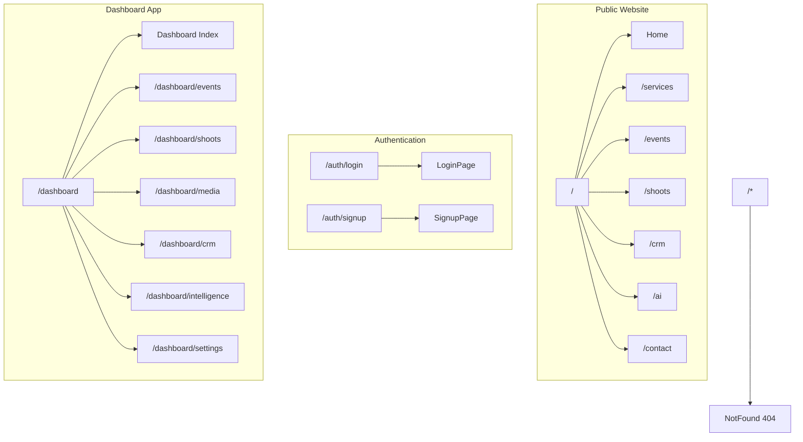
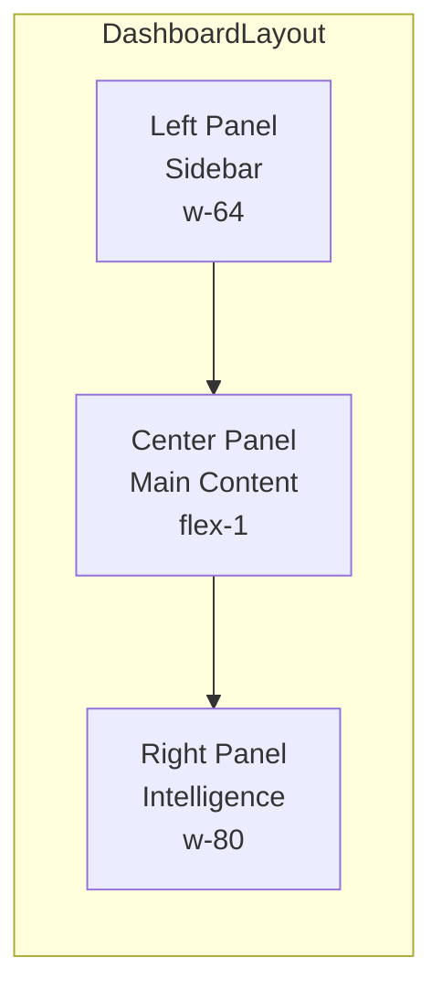
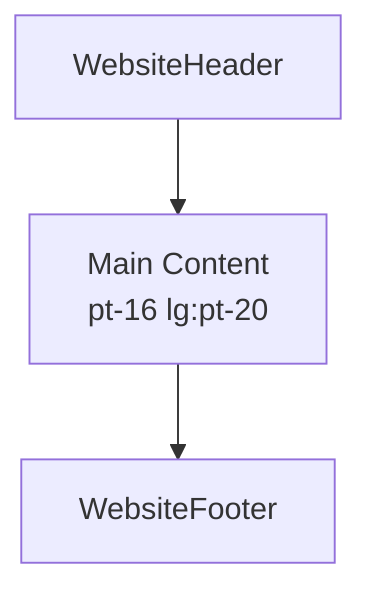
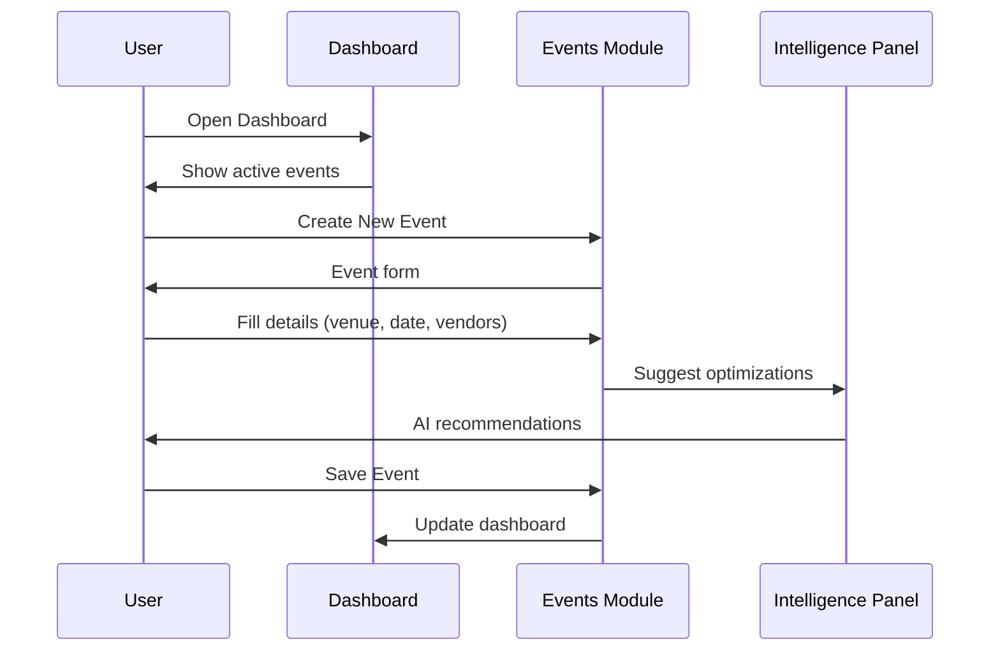
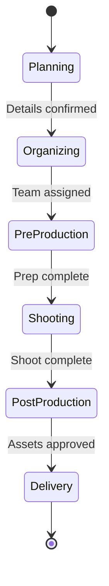
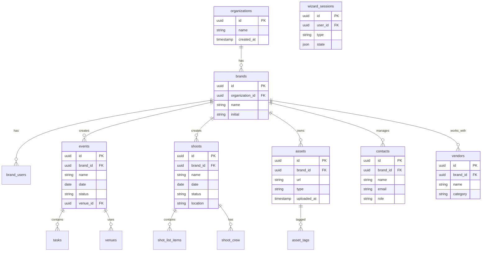

# FashionOS - Technical Documentation

> Last Updated: January 21, 2026

## Project Overview

**FashionOS** is an agentic fashion operations platform that helps fashion brands manage the complete lifecycle from idea → planning → execution → delivery across events, shoots, media, vendors, and CRM relationships.

---

## Tech Stack & Versions

### Core Frameworks

| Technology | Version | Purpose |
|------------|---------|---------|
| React | ^18.3.1 | UI Library |
| TypeScript | ^5.8.3 | Type Safety |
| Vite | ^5.4.19 | Build Tool & Dev Server |
| React Router DOM | ^6.30.1 | Client-side Routing |

### Styling & UI

| Technology | Version | Purpose |
|------------|---------|---------|
| Tailwind CSS | ^3.4.17 | Utility-first CSS |
| tailwindcss-animate | ^1.0.7 | Animation utilities |
| class-variance-authority | ^0.7.1 | Component variant management |
| clsx | ^2.1.1 | Conditional classNames |
| tailwind-merge | ^2.6.0 | Merge Tailwind classes |

### UI Component Libraries

| Technology | Version | Purpose |
|------------|---------|---------|
| shadcn/ui | (custom) | Radix-based component library |
| Radix UI | ^1.x - ^2.x | Accessible primitive components |
| lucide-react | ^0.462.0 | Icon library |
| cmdk | ^1.1.1 | Command palette |
| vaul | ^0.9.9 | Drawer component |
| sonner | ^1.7.4 | Toast notifications |

### Data & State Management

| Technology | Version | Purpose |
|------------|---------|---------|
| @tanstack/react-query | ^5.83.0 | Server state management |
| react-hook-form | ^7.61.1 | Form handling |
| @hookform/resolvers | ^3.10.0 | Form validation resolvers |
| zod | ^3.25.76 | Schema validation |

### Additional Libraries

| Technology | Version | Purpose |
|------------|---------|---------|
| date-fns | ^3.6.0 | Date manipulation |
| recharts | ^2.15.4 | Charts & data visualization |
| react-day-picker | ^8.10.1 | Date picker |
| embla-carousel-react | ^8.6.0 | Carousel/slider |
| react-resizable-panels | ^2.1.9 | Resizable panel layouts |
| next-themes | ^0.3.0 | Theme management |
| input-otp | ^1.4.2 | OTP input component |

### Development Tools

| Technology | Version | Purpose |
|------------|---------|---------|
| ESLint | ^9.32.0 | Code linting |
| Vitest | ^3.2.4 | Unit testing |
| @testing-library/react | ^16.0.0 | React testing utilities |
| @vitejs/plugin-react-swc | ^3.11.0 | SWC-based React plugin |
| lovable-tagger | ^1.1.13 | Component tagging |

---

## Directory Structure

```
fashionos/
├── docs/                          # Documentation
│   ├── 01-overview.md            # This file
│   └── CHANGELOG.md              # Version history
│
├── public/                        # Static assets
│   ├── favicon.ico
│   ├── placeholder.svg
│   └── robots.txt
│
├── src/
│   ├── assets/                    # Image assets
│   │   ├── dashboard-preview.jpg
│   │   ├── fashion-backstage.jpg
│   │   ├── fashion-event.jpg
│   │   ├── fashion-media.jpg
│   │   ├── fashion-shoot.jpg
│   │   └── hero-runway.jpg
│   │
│   ├── components/
│   │   ├── common/               # Shared components
│   │   │   └── PlaceholderPage.tsx
│   │   │
│   │   ├── layout/               # Layout components
│   │   │   ├── DashboardLayout.tsx
│   │   │   ├── DashboardSidebar.tsx
│   │   │   ├── IntelligencePanel.tsx
│   │   │   ├── WebsiteFooter.tsx
│   │   │   ├── WebsiteHeader.tsx
│   │   │   └── WebsiteLayout.tsx
│   │   │
│   │   ├── ui/                   # shadcn/ui components
│   │   │   ├── accordion.tsx
│   │   │   ├── button.tsx
│   │   │   ├── card.tsx
│   │   │   ├── dialog.tsx
│   │   │   ├── input.tsx
│   │   │   ├── label.tsx
│   │   │   └── ... (50+ components)
│   │   │
│   │   └── NavLink.tsx
│   │
│   ├── hooks/                    # Custom React hooks
│   │   ├── use-mobile.tsx
│   │   └── use-toast.ts
│   │
│   ├── lib/                      # Utility libraries
│   │   └── utils.ts
│   │
│   ├── pages/
│   │   ├── auth/                 # Authentication pages
│   │   │   ├── LoginPage.tsx
│   │   │   └── SignupPage.tsx
│   │   │
│   │   ├── dashboard/            # Authenticated app pages
│   │   │   ├── CRMPage.tsx
│   │   │   ├── Dashboard.tsx
│   │   │   ├── EventsPage.tsx
│   │   │   ├── IntelligencePage.tsx
│   │   │   ├── MediaPage.tsx
│   │   │   ├── SettingsPage.tsx
│   │   │   └── ShootsPage.tsx
│   │   │
│   │   ├── website/              # Public marketing pages
│   │   │   ├── AIInfoPage.tsx
│   │   │   ├── ContactPage.tsx
│   │   │   ├── CRMInfoPage.tsx
│   │   │   ├── EventsInfoPage.tsx
│   │   │   ├── Home.tsx
│   │   │   ├── ServicesPage.tsx
│   │   │   └── ShootsInfoPage.tsx
│   │   │
│   │   ├── Index.tsx
│   │   └── NotFound.tsx
│   │
│   ├── test/                     # Test files
│   │   ├── example.test.ts
│   │   └── setup.ts
│   │
│   ├── types/                    # TypeScript types
│   │   └── index.ts
│   │
│   ├── App.css
│   ├── App.tsx                   # Main app with routing
│   ├── index.css                 # Global styles & design tokens
│   ├── main.tsx                  # Entry point
│   └── vite-env.d.ts
│
├── eslint.config.js
├── index.html
├── package.json
├── postcss.config.js
├── tailwind.config.ts
├── tsconfig.json
├── vite.config.ts
└── vitest.config.ts
```

---

## Routing & Sitemap

### Route Architecture



### Complete Sitemap

| Route | Component | Layout | Status |
|-------|-----------|--------|--------|
| **Public Website** ||||
| `/` | Home | WebsiteLayout | ✅ Complete |
| `/services` | ServicesPage | WebsiteLayout | 🔲 Placeholder |
| `/events` | EventsInfoPage | WebsiteLayout | 🔲 Placeholder |
| `/shoots` | ShootsInfoPage | WebsiteLayout | 🔲 Placeholder |
| `/crm` | CRMInfoPage | WebsiteLayout | 🔲 Placeholder |
| `/ai` | AIInfoPage | WebsiteLayout | 🔲 Placeholder |
| `/contact` | ContactPage | WebsiteLayout | 🔲 Placeholder |
| **Authentication** ||||
| `/auth/login` | LoginPage | None | ✅ UI Only |
| `/auth/signup` | SignupPage | None | ✅ UI Only |
| **Dashboard** ||||
| `/dashboard` | Dashboard | DashboardLayout | ✅ Complete |
| `/dashboard/events` | EventsPage | DashboardLayout | 🔲 Placeholder |
| `/dashboard/shoots` | ShootsPage | DashboardLayout | 🔲 Placeholder |
| `/dashboard/media` | MediaPage | DashboardLayout | 🔲 Placeholder |
| `/dashboard/crm` | CRMPage | DashboardLayout | 🔲 Placeholder |
| `/dashboard/intelligence` | IntelligencePage | DashboardLayout | 🔲 Placeholder |
| `/dashboard/settings` | SettingsPage | DashboardLayout | 🔲 Placeholder |
| **Error** ||||
| `/*` | NotFound | None | ✅ Complete |

---

## Router Setup

```tsx
// src/App.tsx - Router Configuration
<BrowserRouter>
  <Routes>
    {/* Website routes - Public */}
    <Route element={<WebsiteLayout />}>
      <Route path="/" element={<Home />} />
      <Route path="/services" element={<ServicesPage />} />
      <Route path="/events" element={<EventsInfoPage />} />
      <Route path="/shoots" element={<ShootsInfoPage />} />
      <Route path="/crm" element={<CRMInfoPage />} />
      <Route path="/ai" element={<AIInfoPage />} />
      <Route path="/contact" element={<ContactPage />} />
    </Route>

    {/* Dashboard routes - Authenticated */}
    <Route path="/dashboard" element={<DashboardLayout />}>
      <Route index element={<Dashboard />} />
      <Route path="events" element={<EventsPage />} />
      <Route path="shoots" element={<ShootsPage />} />
      <Route path="media" element={<MediaPage />} />
      <Route path="crm" element={<CRMPage />} />
      <Route path="intelligence" element={<IntelligencePage />} />
      <Route path="settings" element={<SettingsPage />} />
    </Route>

    {/* Auth routes */}
    <Route path="/auth/login" element={<LoginPage />} />
    <Route path="/auth/signup" element={<SignupPage />} />

    {/* Catch-all */}
    <Route path="*" element={<NotFound />} />
  </Routes>
</BrowserRouter>
```

---

## Import Path Aliases

```typescript
// vite.config.ts & tsconfig.json
{
  "paths": {
    "@/*": ["./src/*"]
  }
}

// Usage examples:
import { Button } from "@/components/ui/button";
import { cn } from "@/lib/utils";
import heroImage from "@/assets/hero-runway.jpg";
import type { Event } from "@/types";
```

---

## Layout System

### 3-Panel Dashboard Layout



| Panel | Width | Content | Responsive |
|-------|-------|---------|------------|
| Left Sidebar | 256px (w-64) | Brand selector, Navigation | Drawer on mobile |
| Center | Flexible | Page content | Always visible |
| Right Intelligence | 320px (w-80) | AI Copilot (placeholder) | Hidden on mobile |

### Website Layout



---

## Application Workflows

### User Journey Flow

```mermaid
flowchart TD
    A[Landing Page] --> B{User Action}
    B -->|Sign Up| C[/auth/signup]
    B -->|Sign In| D[/auth/login]
    B -->|Explore| E[/services or feature pages]
    
    C --> F[Dashboard]
    D --> F
    
    F --> G{Dashboard Actions}
    G -->|Create Event| H[Events Page]
    G -->|Create Shoot| I[Shoots Page]
    G -->|Manage Media| J[Media Page]
    G -->|Manage CRM| K[CRM Page]
    G -->|AI Assistant| L[Intelligence Page]
    G -->|Settings| M[Settings Page]
```

### Event Management Workflow (Future)



### Shoot Production Workflow (Future)



---

## Screens & Features

### Website Pages

| Page | Purpose | Sections |
|------|---------|----------|
| **Home** | Marketing landing | Hero, Features, How It Works, Platform Preview, Audiences, CTA |
| **Services** | Service overview | Placeholder |
| **Events** | Events info | Placeholder |
| **Shoots** | Shoots info | Placeholder |
| **CRM** | CRM info | Placeholder |
| **AI** | AI features info | Placeholder |
| **Contact** | Contact form | Placeholder |

### Dashboard Screens

| Screen | Purpose | Features |
|--------|---------|----------|
| **Dashboard** | Command center | Stats, Active Events, Active Shoots, Recent Activity, Quick Actions |
| **Events** | Event management | List, Create, Edit, Delete events |
| **Shoots** | Shoot management | List, Create, Edit, Delete shoots |
| **Media** | Asset library | Upload, Organize, Tag, Search assets |
| **CRM** | Contact management | Contacts, Vendors, Sponsors |
| **Intelligence** | AI Copilot | Smart suggestions, Automation (Coming Soon) |
| **Settings** | User settings | Profile, Preferences, Team |

---

## Design System

### Typography

| Font | Usage |
|------|-------|
| Playfair Display | Display/headings (font-display) |
| Inter | Body text (font-sans) |

### Color Tokens

```css
/* Neutral palette - no pink/purple */
--background: 60 9% 98%;      /* Off-white */
--foreground: 20 14% 4%;      /* Near black */
--primary: 20 14% 4%;         /* Black */
--secondary: 60 5% 96%;       /* Warm gray */
--muted: 60 5% 90%;           /* Light gray */
--accent: 40 6% 30%;          /* Dark warm gray */
--card: 0 0% 100%;            /* White */
--border: 20 6% 90%;          /* Light border */
```

### Component Variants

Button variants: `default`, `hero`, `accent`, `outline`, `outline-accent`, `minimal`, `ghost`, `link`, `destructive`

---

## Database Schema (Reference)

> Note: Database not yet implemented. These are canonical table names for future use.



---

## Environment & Configuration

### Vite Configuration

```typescript
// vite.config.ts
export default defineConfig({
  server: {
    host: "::",
    port: 8080,
    hmr: { overlay: false }
  },
  plugins: [react(), componentTagger()],
  resolve: {
    alias: { "@": "./src" }
  }
});
```

### TypeScript Configuration

- `strict: true`
- Path aliases: `@/*` → `./src/*`
- Target: ES2020
- Module: ESNext

---

## URLs

| Environment | URL |
|-------------|-----|
| Preview | https://id-preview--60e36c0f-ed03-40ea-896f-af4f5c556842.lovable.app |
| Published | https://fashionflow-ops-suite.lovable.app |

---

## Phase Status

| Phase | Status | Description |
|-------|--------|-------------|
| **Phase 1** | ✅ Complete | Frontend foundation, layouts, public website, dashboard structure |
| **Phase 2** | 🔲 Planned | Authentication, database integration |
| **Phase 3** | 🔲 Planned | AI Copilot & Intelligence features |
